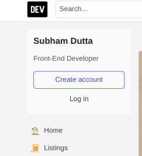

# DOM Manipulation Assignments:
## 1. Website: [dev.to](dev.to)

>Topics: Query Selctory, Inner HTML


**Screenshot before:** 


    Task: Target the Top description div and change the DEV Community to <Your_Name> and description to your passion 

**Screenshot After:** 



**Code Snippet:** 
```js
let head = document.querySelector(".sidebar-wrapper-left .side-bar .crayons-card .crayons-subtitle-2")
let about = document.querySelector(".sidebar-wrapper-left .side-bar .crayons-card .color-base-70")

head.innerText = "Subham Dutta"
about.innerText = "Front-End Developer"
```

## 2. Website: [Apple](https://support.apple.com/en-in)

    Task: Fetch all the product name and store in an array


### Output

    (7) ['iPhone Support', 'Mac Support', 'iPad Support', 'Watch Support', 'AirPods Support', 'Music Support', 'TV Support']

**Code Snippet:** 
```js
let elements = document.getElementsByClassName("as-imagegrid-item-title");
let arr = []
for (var i = 0, len = elements.length; i < len; i++) {
    arr[i] = elements[i].textContent
}
console.log(arr)
```

## 3. Webiste Name: [Youtube Support](https://support.google.com/youtube/)

>Topics- Get Element By Id, Create Element, Create Text Node, Append Child

### Sample Image


    Tasks: Add another FAQ 'My New FAQ' to the list

### Output