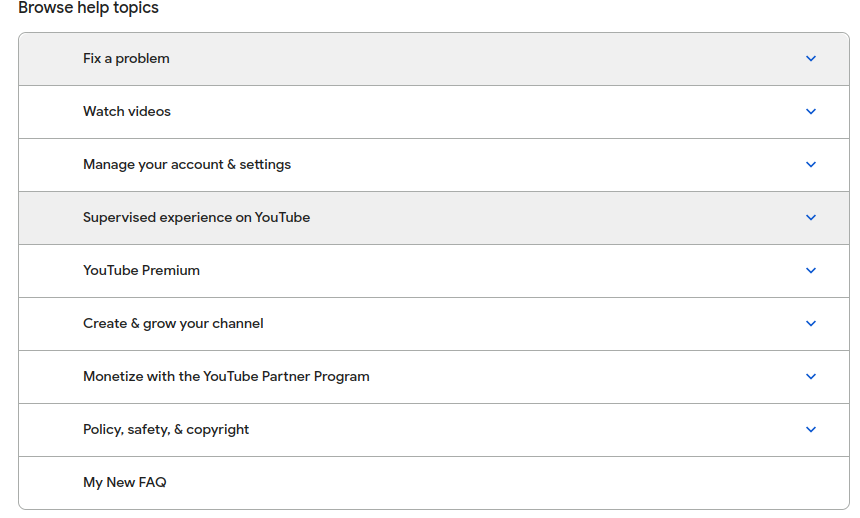
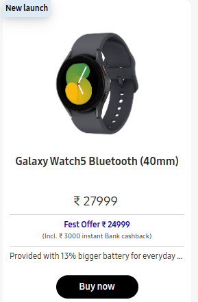
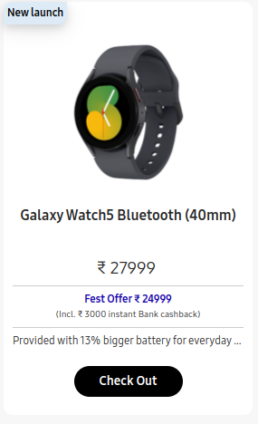

# DOM Manipulation Assignments:
## 1. Website: [dev.to](dev.to)

>Topics: Query Selctory, Inner HTML


**Screenshot before:** 


    Task: Target the Top description div and change the DEV Community to <Your_Name> and description to your passion 

**Screenshot After:** 


**Code Snippet:** 
```js
let head = document.querySelector(".sidebar-wrapper-left .side-bar .crayons-card .crayons-subtitle-2")
let about = document.querySelector(".sidebar-wrapper-left .side-bar .crayons-card .color-base-70")

head.innerText = "Subham Dutta"
about.innerText = "Front-End Developer"
```

## 2. Website: [Apple](https://support.apple.com/en-in)

    Task: Fetch all the product name and store in an array


### Output

    (7) ['iPhone Support', 'Mac Support', 'iPad Support', 'Watch Support', 'AirPods Support', 'Music Support', 'TV Support']

**Code Snippet:** 
```js
let elements = document.getElementsByClassName("as-imagegrid-item-title");
let arr = []
for (var i = 0, len = elements.length; i < len; i++) {
    arr[i] = elements[i].textContent
}
console.log(arr)
```

## 3. Webiste Name: [Youtube Support](https://support.google.com/youtube/)

>Topics- Get Element By Id, Create Element, Create Text Node, Append Child

**Sample Image**


    Tasks: Add another FAQ 'My New FAQ' to the list

### Output: 




**Code Snippet:** 

```js
const newSec = document.createElement("section");
let newFaqSec = document.querySelector(".accordion-homepage");
newFaqSec.appendChild(newSec)
newSec.className = "parent";
newSec.id = "new-parent";
const newHead = document.createElement("h3")
let textNode = document.createTextNode("My New FAQ");
newHead.appendChild(textNode);
let newFaq = document.querySelector("#new-parent");
newFaq.appendChild(newHead)
```
## 4. Webiste Name: [OnePlus](https://www.oneplus.in/support)

>Topics:Query Selector, InnerText

### Sample Image


    Tasks:  Change the contact number.

### Output: 


### Code Snippet:

```js
let contact = document.querySelector(".service-number");
contact.innerText = "+91 1234567890";
```

## 5. Webiste Name: [Samsung](https://www.samsung.com/in/offer/online/samsung-fest/)


>TopicsgetElementById, createElement, InnerText, append, setAttribute

    Task: Target the main div of card and change the Button text to Check out
### Sample Image


### Output:



### Code snippet:

```js
let offers = document.querySelectorAll(".diwali-deals-product-sale-pro-outer")
let offerLength = offers.length
let myOffer = offers[offerLength - 1]
myOffer.getElementsByClassName("diwali-deals-product-sale-btn")[0].innerText = "Check Out"
```


## 6. Webiste Name: [Adidas](https://www.adidas.co.in/)

>Topics: Query Selector, Event listeners, Changing Styles

### Sample Image:


    Tasks: Target the search box and on hover change thebackground color to red.

### Output:


### Code snippet: 
```js
let search = document.querySelector(".searchinput___19uW0")
search.addEventListener("mouseenter", () => {
    search.style.backgroundColor = "#ff4d4d";
})
search.addEventListener("mouseleave", () => {
    search.style.backgroundColor = "#ff4d4d";
})
```