# <center>**SUBHAM DUTTA**</center>

## <center>DOM Manipulation Assignments: </center>


## 1. Website: [dev.to](dev.to)

>Topics: Query Selctory, Inner HTML


### Screenshot before:


    Task: Target the Top description div and change the DEV Community to <Your_Name> and description to your passion 

### Screenshot After:

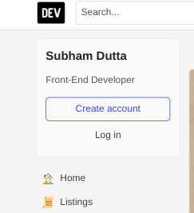

### Code Snippet:

```js
let head = document.querySelector(".sidebar-wrapper-left .side-bar .crayons-card .crayons-subtitle-2")
let about = document.querySelector(".sidebar-wrapper-left .side-bar .crayons-card .color-base-70")

head.innerText = "Subham Dutta"
about.innerText = "Front-End Developer"
```

## 2. Website: [Apple](https://support.apple.com/en-in)

    Task: Fetch all the product name and store in an array


### Output

    (7) ['iPhone Support', 'Mac Support', 'iPad Support', 'Watch Support', 'AirPods Support', 'Music Support', 'TV Support']

### Code Snippet:

```js
let elements = document.getElementsByClassName("as-imagegrid-item-title");
let arr = []
for (var i = 0, len = elements.length; i < len; i++) {
    arr[i] = elements[i].textContent
}
console.log(arr)
```

## 3. Webiste Name: [Youtube Support](https://support.google.com/youtube/)

>Topics- Get Element By Id, Create Element, Create Text Node, Append Child

### Sample Image: 


    Tasks: Add another FAQ 'My New FAQ' to the list

### Output: 

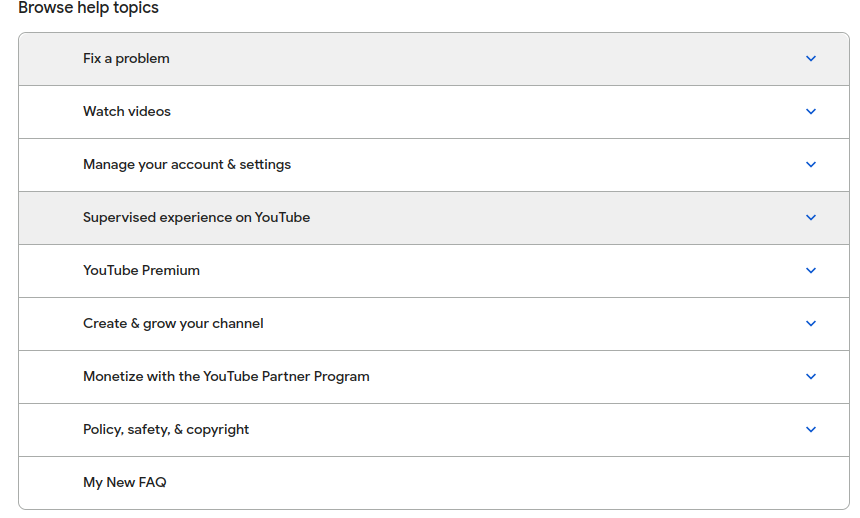


**Code Snippet:** 

```js
const newSec = document.createElement("section");
let newFaqSec = document.querySelector(".accordion-homepage");
newFaqSec.appendChild(newSec)
newSec.className = "parent";
newSec.id = "new-parent";
const newHead = document.createElement("h3")
let textNode = document.createTextNode("My New FAQ");
newHead.appendChild(textNode);
let newFaq = document.querySelector("#new-parent");
newFaq.appendChild(newHead)
```
## 4. Webiste Name: [OnePlus](https://www.oneplus.in/support)

>Topics:Query Selector, InnerText

### Sample Image


    Tasks:  Change the contact number.

### Output: 


### Code Snippet:

```js
let contact = document.querySelector(".service-number");
contact.innerText = "+91 1234567890";
```

## 5. Webiste Name: [Samsung](https://www.samsung.com/in/offer/online/samsung-fest/)


>TopicsgetElementById, createElement, InnerText, append, setAttribute

    Task: Target the main div of card and change the Button text to Check out
### Sample Image
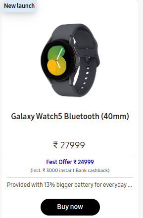

### Output:
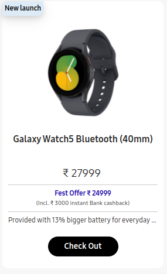


### Code snippet:

```js
let offers = document.querySelectorAll(".diwali-deals-product-sale-pro-outer")
let offerLength = offers.length
let myOffer = offers[offerLength - 1]
myOffer.getElementsByClassName("diwali-deals-product-sale-btn")[0].innerText = "Check Out"
```


## 6. Webiste Name: [Adidas](https://www.adidas.co.in/)

>Topics: Query Selector, Event listeners, Changing Styles

### Sample Image:


    Tasks: Target the search box and on hover change thebackground color to red.

### Output:


### Code snippet: 
```js
let search = document.querySelector(".searchinput___19uW0")
search.addEventListener("mouseenter", () => {
    search.style.backgroundColor = "#ff4d4d";
})
search.addEventListener("mouseleave", () => {
    search.style.backgroundColor = "#ff4d4d";
})
```

## 7. Webiste Name: [MDN Web Docs](https://developer.mozilla.org/en-US/)

>Topics: Form, Value, Submit

### Sample Image

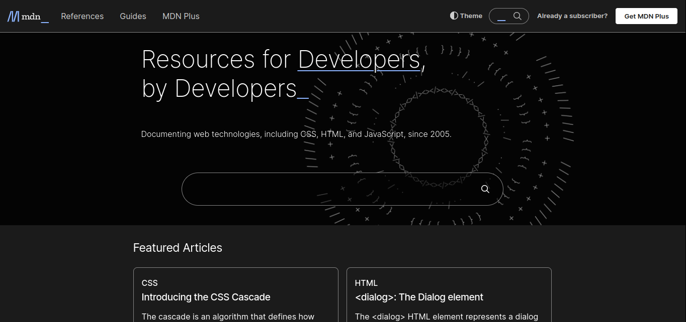

    Tasks: To Search a topic in the MDN Search bar.First add a text to search in the search bar and then hit the submit search button to search the docs using DOM

### Output

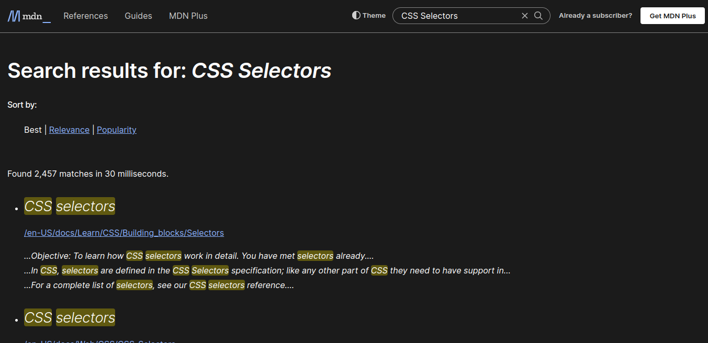

### Code snippet:
```js
document.getElementById("hp-search-input").value = "CSS Selectors";
document.getElementById("hp-search-form").submit()
```

## 8. Webiste Name: [Google](https://www.google.com/)

>Topics: Remove Elements

### Sample Image:

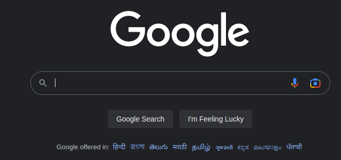

    Tasks: Remove alternate languages from the home page languages listed

### Output

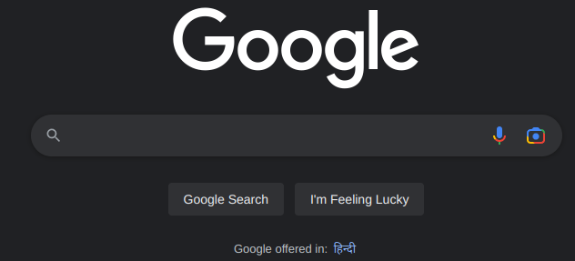

### Code snippet: 

```js
let langs = document.getElementById("SIvCob").childNodes;
for(let i = 3; i < langs.length; i++){
    langs[i].remove();
}
```

## 9. Webiste Name: [Code Wars](https://www.codewars.com/)

> Topics: Change Font Family, Color of Text.

### Sample Image:


    Tasks: Change the font family of the text to monospace and text color to the logo’s background color.

### Output:

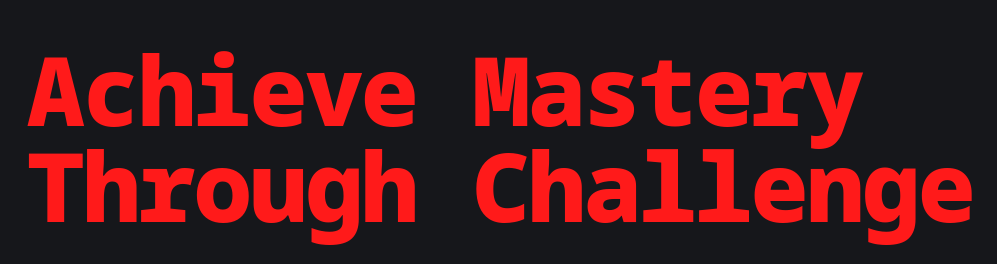

### Code snippet: 
```js
let heading = document.querySelector(".display-heading-1");
heading.style.fontFamily = "monospace";
heading.style.color = "#ff1a1a";
```

## 10. Webiste Name: [Freecodecamp](https://www.freecodecamp.org/)

>Topics: querySelector, mouseover, click eventListener,  callback function, style,

### Sample Image: 

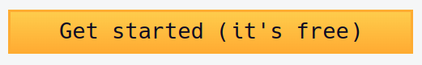

    Tasks: Target the button and change background colour on mouseover

### Output


### Code Snippet: 

```js
let allbtn = document.querySelectorAll(".login-btn-text");
allbtn[1].style.backgroundColor = "#ed2fe9";
```

## 11. Webiste Name: [realme](https://www.realme.com/in/)

>Topics: querySelector,style,background-image

### Sample Image

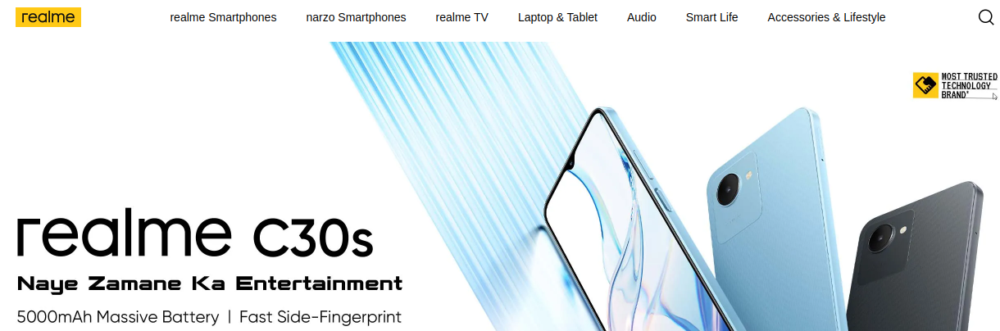

    Tasks: change the realme logo to ineuron logo

### Output

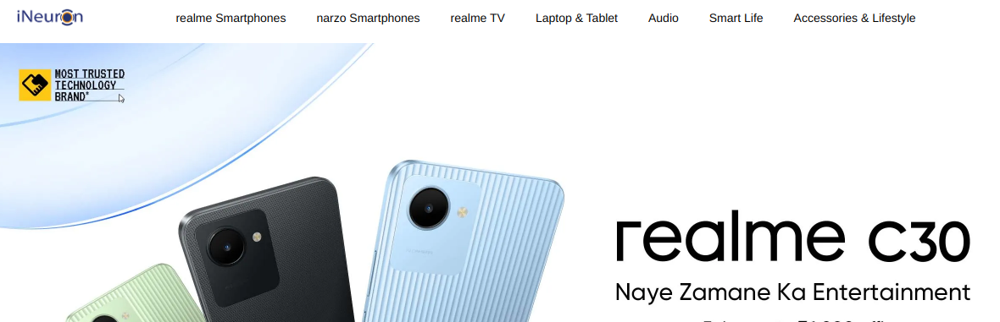

### Code Snippet: 

```js
let logo = document.getElementsByClassName("icon-logo")
logo[0].style.backgroundImage = "url('https://account.ineuron.ai/static/images/ineuron-logo.png')";
```

## 12. Webiste Name: [Github](https://github.com/)

>Topics: querySelector,style,background-Color

### Sample Image

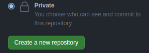

    Tasks: change the background colour of the button to blue.

### Output

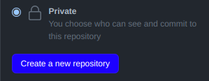

### Code Snippet:

```js
let btn = document.getElementsByClassName("btn btn-sm btn-primary");
let bluebtn = btn[1];
bluebtn.style.backgroundColor = "#1d00ff";
```

## 13. Webiste Name: [Hackerrank](https://www.hackerrank.com/)

>Topics: querySelector,innerHtml

### Sample Image:


    Tasks: Target the top description and change “Matching developers with great companies” to ‘JSBOOTCAMP“.

### Output:

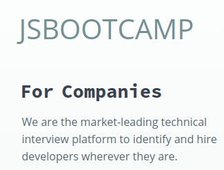

### Code snippet: 

```js
let descr = document.querySelector(".fl-heading-text");
descr.innerHTML = "JSBOOTCAMP";
```
## 14. Webiste Name: [Asus](https://www.asus.com/in/)

>Topics: querySelector,style,font-size

### Sample Image:


    Tasks: change the fontsize of “Hot Deals” to 80px

### Output: 


### Code Snippet: 

```js
let hdeals = document.querySelector(".HotDealsAll__Heading__2fIbe")
hdeals.style.fontSize = "80px"
```

## 15. Webiste Name: [Dell](https://www.dell.com/en-in/shop/deals/laptop-deals?gacd=10415953-9016-5761040-285981356-0&dgc=ST&gclid=Cj0KCQjwguGYBhDRARIsAHgRm4-XUDMhhVNyHXb3s1gY4ZBzORr_d9Se-buhJwy7asyUe7YdqEA11eEaAt6UEALw_wcB&gclsrc=aw.ds&nclid=BxjBlpBQsX6pjSHh-L8YYSU77EpfXRkG1AGMB5Wbeu386ykspfrPDnfx_DdFau20)

>Topics: querySelector,style.textAlign

### Sample Image: 


    Tasks: Convert the text “G15 Gaming Laptop” from left to right

### Output


### Code Snippet: 
```js
let g15 = document.querySelectorAll(".ps-title");
for(i = 0; i < g15.length; i++){
    if(g15[i].innerText == "G15 Gaming Laptop"){
        g15[i].style.textAlign = "right";
        console.log(g15[i])
    }
    else continue;
}
```

## 16. Webiste Name: [Vercel](https://vercel.com/)

>Topics: querySelector,innerHTMl

### Sample Image: 


    Tasks: change the heading “Start with the developer” to “Start with Scratch”

### Output: 

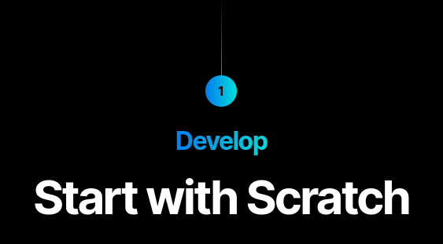

### Code Snippet: 

```js
let head = document.querySelector(".section-title_title__VEDfK")
head.innerText = "Start with Scratch"
```

## 17. Webiste Name: [Sony](https://www.sony.co.in/)

>Topics: querySelector,innerHTMl

### Sample Image: 

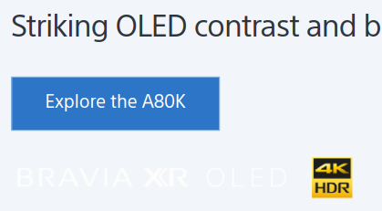

    Tasks: change the button text To current Date.

### Output: 

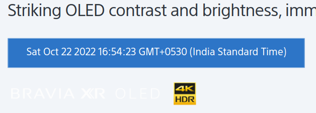

### Code snippet: 
```js
let today = new Date;
let btn = document.querySelector(".PrimaryTout__ButtonText");
btn.innerText = today
```
## 18. Webiste Name: [Philips](https://www.philips.co.in/)

>Topics: querySelector,style,backgroundcolor

### Sample Image

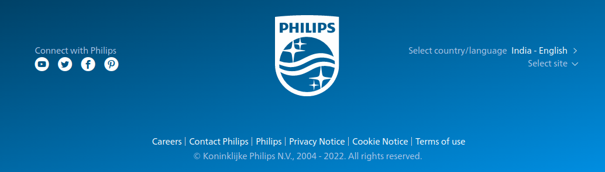

    Tasks: change the background colour blue to orange

### Output

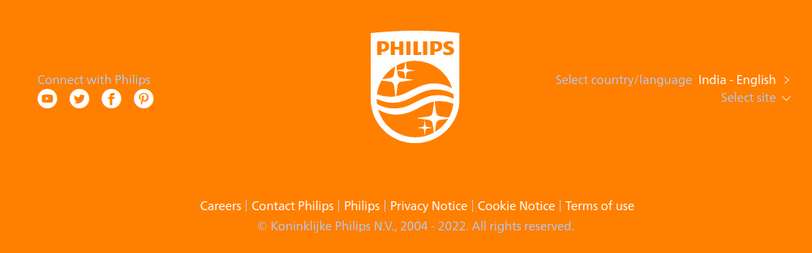

### Code snippet: 

```js
let foot2 = document.querySelector(".p-footer")
foot2.style.background = "#ff7f00"
```

## 19. Webiste Name: [Canon](https://in.canon/)

>Topics: querySelector,src


    Tasks: extract the canon logo

### Output

`https://in.canon/assets/brand/logo-300-002e45a4aec98fd92899838da9d5560f.png`
### Code snippet: 
```js
document.querySelector(".logo").src
```

## 20. Webiste Name: [Oppo](https://www.oppo.com/in/)

>Topics: querySelector,style,color

### Sample Image


    Tasks: Change the description colour black to orange

### Output


### Code Snippet: 
```js
let desc = document.querySelector(".desc");
desc.style.color = "orange";
```

<br>

# Contact me: [Linkedin](https://www.linkedin.com/in/subham-dutta-8670b8178/) | [Github](https://github.com/Sduttt) | [Twitter](https://twitter.com/Subhamd88404337) | [Facebook](https://www.facebook.com/profile.php?id=100073951804006) | [Instagram](https://www.instagram.com/its_subham_dutta/)