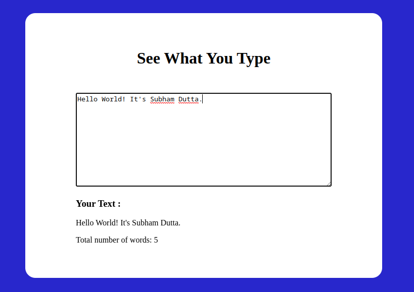

# 
 **Javascript Projects** 

>In this repository, I will update all the projects I have done and will be doing in future on Javascript. I will update this repository as soon as I make a new project. Here are the list of projects: 

## **1. DOM Manipulation Challenges:** 
In this project I have completed all the DOM Manipulation challenges given by my mentor. [Project link](./DOM/solution.md)

## **2. JS Hometask's:**
These are some small questions and challanges on javascript mainly based on theory provided by my mentors. [Hometask link](./JS_Hometask/)

## **3. Distraction Tracker:**
This is a simple app that helps you to track how oftenly you distract from your work/study. You can also store the number of times you have distracted in the previous time and then compare with current time, thus improve your performance. Another feature is, it will alert you if you get distracted more oftenly.

**Screenshot:** 

**Source Code:** [Here](./Projects/distraction-tracker/)

**Live link:** [Here](https://disttrack.netlify.app/) 

## **4. Click The Button:**

This simple project counts how many times you have clicked the button.

**Screenshot:** 

**Source Code:** [Here](./Projects/1-ClickTheButton/)

**Live link:** [Here](https://click-d-btn.netlify.app/) 

## **5. Basic Counter:** 
This is a basic counter that can count a single degit increment and decrement function.

**Screenshot:** 

**Source Code:** [Here](./Projects/2-BasicCounter/)

**Live link:** [Here](https://basicounter.netlify.app/)

## **6. See What You Type:**
This web app shows the output of what you type in the input textbox in real time.

**Screenshot:** 

**Source Code:** [Here](./Projects/3-SeeWhatYouType/)

**Live link:** [Here](https://seewhatyoutyped.netlify.app/)

## **7. Colour Changer:** 

In this web app, if you click the button the colour of the box will change into another random colour. 

**Screenshot:** 

**Source Code:** [Here](./Projects/4-ColorChanger/)

**Live link:** [Here](https://pick-random-colour.netlify.app/)

## **8. Name Conversion:** 
In this project, I have built a web app that converts any string into Camel Case, Pascal Case:, Snake Case, Screaming Snake Case, Kebab Case and Screaming Kebab Case.

**Screenshot:** 

**Source Code:** [Here](./Projects/5-NameConversion/)

**Live link:** [Here](https://name-format-changer.netlify.app/)

## **9. Age Calculator:** 
This web application can calculates your age accurately in Years Months and Days by getting your date of birth.

**Screenshot:** 

**Source Code:** [Here](./Projects/6-Age-Calculator/)

**Live link:** [Here](https://find-age.netlify.app/)

## **9. Rock-Paper-Scissor Game:** 
This is a classic and very popular game among children. 

**Screenshot:** 

**Source Code:** [Here](./Projects/7-RockPaperScissor/)

**Live link:** [Here](https://subham-rock-paper-scissor.netlify.app/)

## **10. Password generator:** 
This is a password generator app where users can decide How long password they need and What type of charecters should be included in the password. Also there is a button to copy the password in clipboard.

**Screenshot:** 

**Source Code:** [Here](./Projects/8-PasswordGenerator/)

**Live link:** [Here](https://subhamspasswordmaker.netlify.app/)

  

# 
This list will be updated soon!! 

## 
Contact me: [Linkedin](https://www.linkedin.com/in/subham-dutta-8670b8178/) | [Github](https://github.com/Sduttt) | [Twitter](https://twitter.com/Subhamd88404337) | [Facebook](https://www.facebook.com/profile.php?id=100073951804006) | [Instagram](https://www.instagram.com/its_subham_dutta/)
